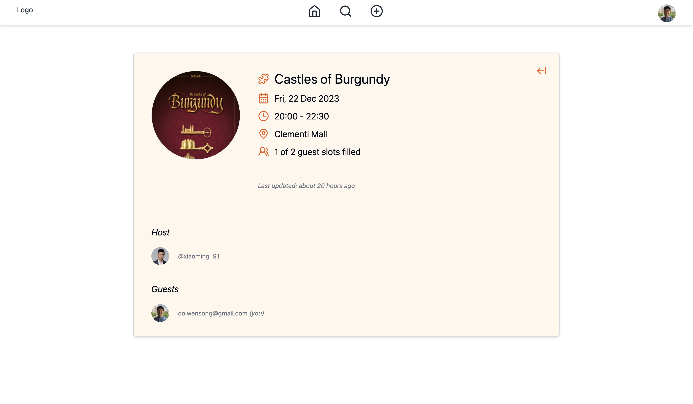
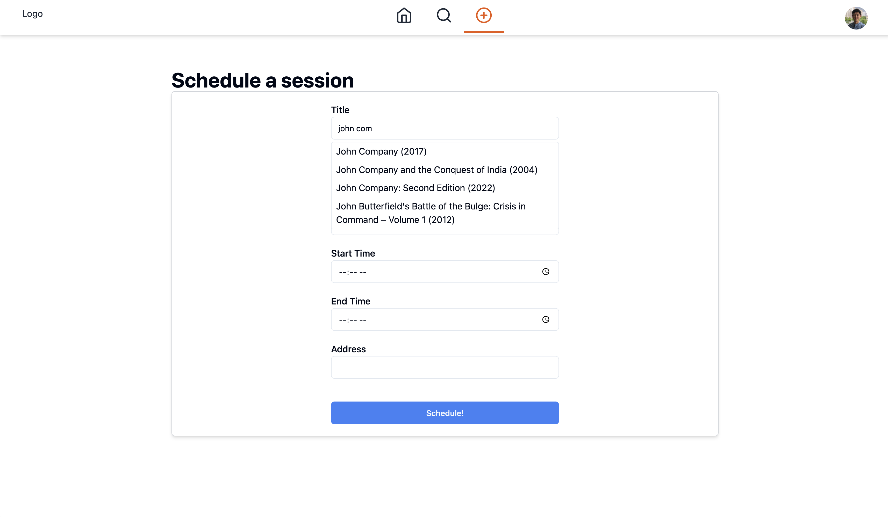

# Boardgame Scheduler

Boardgame Scheduler is an app that allows users to create and host boardgame sessions. These sessions will be listed on the Find-Sessions page for other users to discover. Any interested user will be able to join (or leave) a boardgame session at any time.

## Screenshots

**Homepage** - Users will see a list of upcoming events that they are hosting or have joined, ordered chronologically. Each session is colour-coded based on whether the user is the host or a guest of the session. They are also able to edit/ delete the session (if they are the host) or leave the session (if they are a guest).

**Find-Session** - Users will be able to see sessions hosted by other users on this page. These include sessions they may or may not have already joined. Sessions that are full will also be showned but no users will be able to join until another user leaves. Users can filter these sessions based on game titles or locations of the sessions.

**Session** - The session page contains more information about a particular session. Evidently, users will be able to obtain more information about the host, as well as guests who have joined the session.

**Profile** - The profile page contains information of each user on the platform. This includes a list of sessions that are hosted by that user. Sessions list here can be interacted with as per normal (edit, delete, join, leave).

**Schedule a Session** - A session is created via this page. The "Title" input searches through the BoardGameGeek.com (BGG) database and returns a list of boardgames based on users' inputs. Users choose a matching game from this list which will then update the "Title" input field. The game thumbnails are also obtained this way. This ensures that the game information of each session remains recognisable and consistent throughout Boardgame Scheduler.

## Database

### Entity Relationship Diagram

Boardgame Scheduler's database contains five tables: _users_, _sessions_, _guests_, _roles_ and _library_.

- _Users_. Stores information about users on the platform. This includes roles which is derived from the _roles_ constraint table.
- _Roles_. See above; contains the USER and ADMIN roles.
- _Sessions_. Stores information about each session that is created by a user. The "num_guests", "is_full" and "last_updated" columns are updated automatically by trigger functions (see below).
- _Guests_. Stores information about the guests in each session.
- _Library_. Information about each boardgame will be stored in this table every time a user creates a session. As expected, this information is taken from BGG.

### Trigger Functions

There are trigger functions put in place to execute automatic updates to the _sessions_ table.

- `update_num_guests()`. When a user joins or leaves a session as a guest (_guests_ table is updated), "num_guests" will increase or decrease by one, and if the final figure equals to "max_guests", "is_full" will be updated to `true`, or `false` if unequal.

- `log_last_update()`. Every time the _sessions_ table is updated, this trigger function will create a timestamp in the "last_update" column.

## Technologies Used

- PERN (Postgresql, Express, React, Node) stack

## Getting Started

- Backend. The environment variables used are `PGUSER`, `PGHOST`, `PGPASSWORD`, `PGDATEBASE` and `PGPORT` in the db.js file. Run the sql files inside the tables_sql and trigger_sql directories within this repository to build the database.

- Frontend. The environment variable used is `VITE_SERVER`.

## Next Steps

- Implement a collections feature where users can store a list of games in their collection for other users to view. Games can also be selected from this list when creating a new session.

- Follow/ Favourites system where users can follow other users to see only sessions hosted by them.

- Lat/Long location information for session addresses. This will help users be able to see nearby sessions being hosted.
